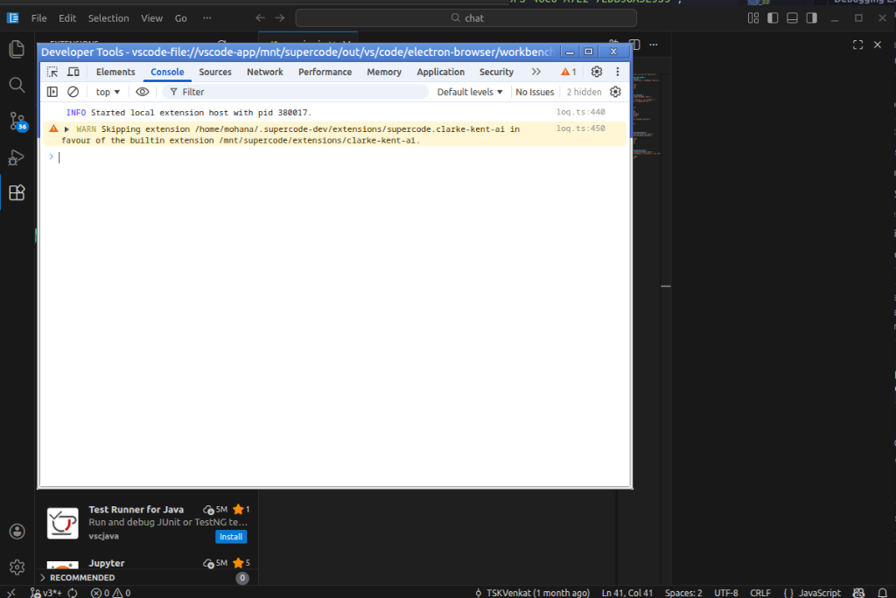

# SuperCode - AI-Powered IDE

<p align="center">
  
</p>

<p align="center">
  <strong>🦸 Meet Clarke Kent - Your AI Coding Assistant</strong>
</p>

<p align="center">
  <a href="#features">Features</a> •
  <a href="#installation">Installation</a> •
  <a href="#getting-started">Getting Started</a> •
  <a href="#ai-features">AI Features</a> •
  <a href="#themes">Themes</a>
</p>

---

## About SuperCode

**SuperCode** is a Superman-themed, AI-powered IDE built on VS Code. It combines the power of modern code editing with cutting-edge AI capabilities through **Clarke Kent**, your AI coding assistant powered by OpenRouter.

> *"With great power comes great code."* - Clarke Kent

## Features

### 🤖 Clarke Kent AI Assistant
- **Prompt-to-Code Generation**: Describe what you want, get working code
- **Multi-Model Support**: Access GPT-4, Claude, Llama, and 100+ models via OpenRouter
- **Smart Model Routing**: Automatically selects the best model for each task
- **Real-Time Editing**: Iterative code refinement with AI assistance
- **Debugging Assistance**: AI-powered error analysis and fix suggestions

### 🎨 Superman Themes
- **Krypton Dark**: Deep space blues with Superman red and gold accents
- **Fortress of Solitude**: Light crystalline theme inspired by Superman's arctic retreat

### 🚀 Developer Productivity
- **Full-Stack Generation**: Generate complete project structures from prompts
- **Preview & Run**: Live preview panel for web applications
- **Agentic Planning**: Multi-step task planning with AI guidance
- **Export & Deploy**: One-click deployment to Vercel, Netlify, and more

### 💻 Built on VS Code
- All the power of VS Code: IntelliSense, debugging, Git integration
- Thousands of extensions compatible
- Cross-platform: Windows, macOS, Linux

## Installation

### Prerequisites
- Node.js 18+ 
- Git
- OpenRouter API Key (get one at [openrouter.ai](https://openrouter.ai))

### Build from Source

```bash
# Clone the repository
git clone https://github.com/supercode-ide/supercode.git
cd supercode

# Install dependencies
npm install

# Download built-in extensions
npm run download-builtin-extensions

# Compile
npm run compile

# Run SuperCode
./scripts/code.sh  # Linux/macOS
.\scripts\code.bat  # Windows
```

## Getting Started

1. **Launch SuperCode** and open a folder or workspace
2. **Open Clarke Kent Chat**: Press `Ctrl+Shift+P` → "Clarke Kent: Open Chat"
3. **Configure API Key**: Enter your OpenRouter API key when prompted
4. **Start Coding with AI**: Type a prompt like "Create a React component for a todo list"

## AI Features

### Prompt-to-Code Generation
```
You: Create a REST API endpoint for user authentication in Express.js

Clarke Kent: I'll create a complete authentication endpoint with JWT tokens...
[Generates working code]
```

### Code Refinement
Select any code and use "Clarke Kent: Refine Selection" to iteratively improve it.

### Debugging Assistance
When you encounter an error, use "Clarke Kent: Analyze Error" to get AI-powered debugging help.

### Full-Stack Generation
Use "Clarke Kent: Generate Project" to create entire application structures from a description.

## Themes

### Krypton Dark
A deep, immersive dark theme with Superman's iconic colors:
- **Background**: Deep space blue (#0A1929)
- **Accent**: Superman red (#CC0000) and gold (#FFD700)
- **Syntax**: Vibrant colors for excellent readability

### Fortress of Solitude
A light theme inspired by Superman's crystal fortress:
- **Background**: Pristine white with ice blue tints
- **Accent**: Crystal blue highlights
- **Syntax**: Clear, professional coloring

## Configuration

### OpenRouter Settings
```json
{
  "clarkeKent.apiKey": "your-openrouter-api-key",
  "clarkeKent.defaultModel": "anthropic/claude-3.5-sonnet",
  "clarkeKent.enableSmartRouting": true,
  "clarkeKent.costTracking": true
}
```

### Model Selection
Clarke Kent can automatically route prompts to the best model, or you can manually select:
- **Claude 3.5 Sonnet**: Best for planning and complex reasoning
- **GPT-4o**: Fast code generation
- **GPT-3.5 Turbo**: Quick, cost-effective simple tasks

## Contributing

We welcome contributions! See [CONTRIBUTING.md](CONTRIBUTING.md) for guidelines.

## License

SuperCode is released under the [MIT License](LICENSE.txt).

---

<p align="center">
  <strong>Built with 💙❤️💛 by the SuperCode Team</strong>
</p>
